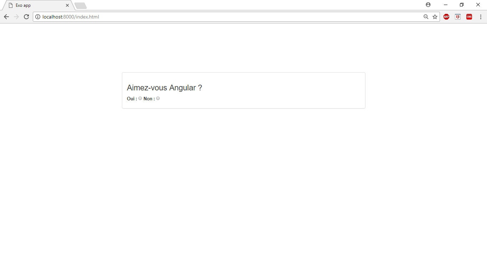
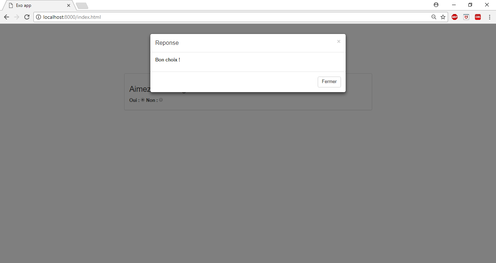

# Exojs

> web app 

## Setup
### Install Node.js, npm
go to `https://www.npmjs.com/get-npm`
### Run the app
After you clone this repo to your desktop
In the terminal, navigate to pathTo/ExoNodeJs-master folder, run `npm run dev` for a dev server. Navigate to `http://localhost:8000/index.html`.
